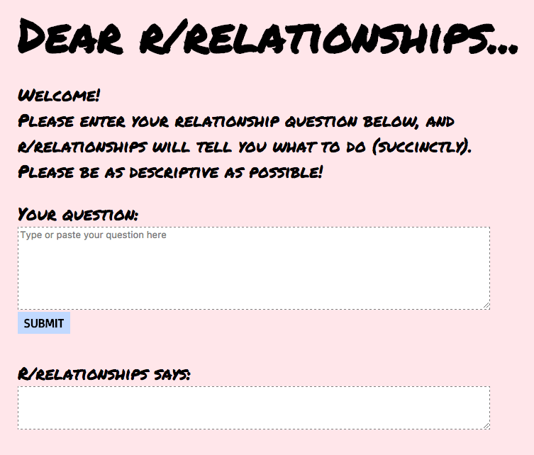

# relationship-advice-app

This app takes a relationship question and answers it using NLP!

These answers are generated using data collected from reddit.com/r/relationships. 

The files in this repo are:
* relationship_app.html - the html/css/javascript code for the website
* relationships.py - python file that returns the best answer for the user's question
* relationship_app_ppt.pdf - the powerpoint presentation that accompanies this project
* data_cleaning_answer.ipynb - jupyter notebook with the data cleaning and techniques such as TFIDF vectorization, NMF, and sentiment analysis

